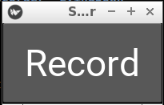

# KivyScreenRecorder
This is a screen recorder based on Kivy and FFmpeg.

### Requirements
[auto_everything](https://github.com/yingshaoxo/auto_everything#installation)

[kivy (daily version)](https://kivy.org/docs/installation/installation-linux.html#ubuntu-kubuntu-xubuntu-lubuntu-saucy-and-above)

### Usage
```
python3 main.py
```

### Recorded Videos
`~/Videos/doing`

___


